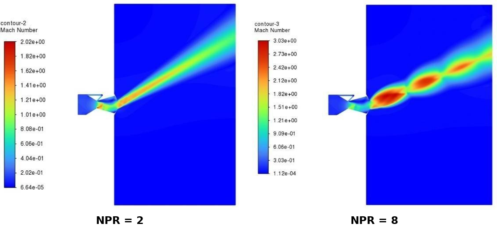
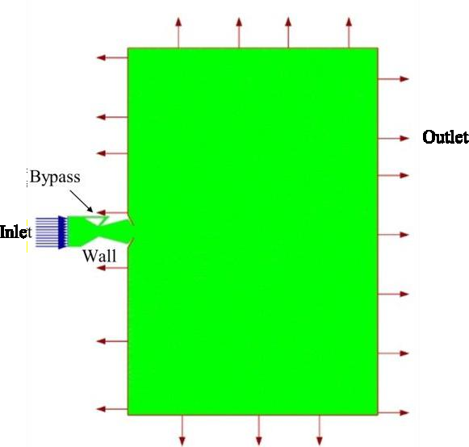
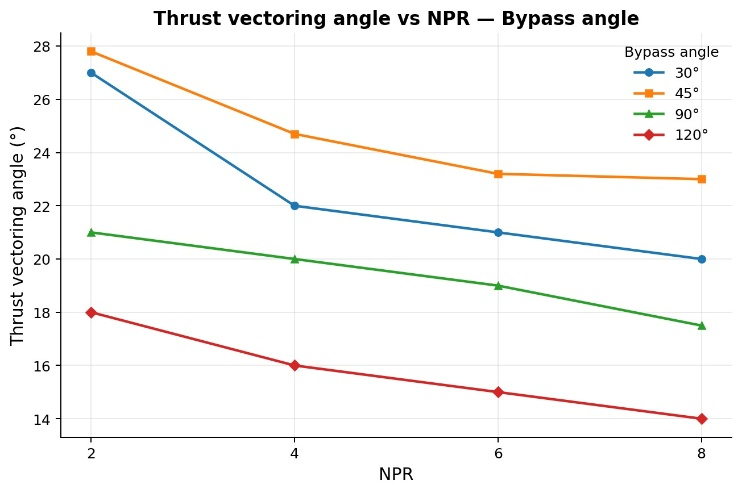
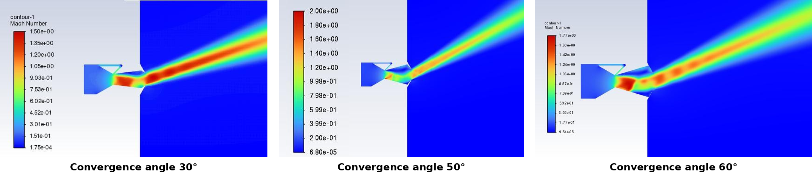
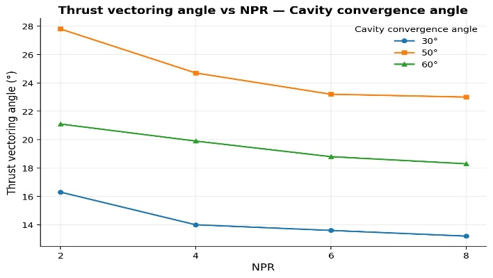

# Thrust Vectoring of a Bypass Dual Throat Nozzle (BDTN): CFD Study

**Final Year Project** | Department of Aeronautical Engineering, Global Academy of Technology, Bengaluru
Team project with Uttargosh J, guided by Dr. Paramesh T

## Summary
A 2D CFD study in ANSYS Fluent of how the **bypass injection angle** and the
**cavity convergence angle** affect fluidic thrust vectoring in a BDTN, for
NPR = 2 to 8, using steady RANS with the realizable k–ε model.

## My Role
I ran the CFD simulations and post-processing for the bypass angle and cavity
convergence angle studies in ANSYS Fluent, and prepared the contours and plots.
The cavity length study was done by my teammates.

## Tools
ANSYS Design Modeler · ANSYS Meshing · ANSYS Fluent

## Setup
| Item | Value |
|------|-------|
| Geometry | 2D; inlet 60 mm, throat 20 mm, bypass 2.6 mm, exit 24 mm |
| Mesh | Structured, 272,889 cells |
| Solver | Density-based implicit, steady RANS, second-order upwind |
| Turbulence model | Realizable k–ε |
| Boundary conditions | Pressure inlet (NPR 2, 4, 6, 8), pressure outlet, adiabatic walls |
| Validation | Centerline pressure trends vs. Afridi et al. (2024) |

## Key Results
- Maximum deflection of **27.8°** at NPR = 2, 45° bypass angle, 50° convergence angle
- Vectoring angle decreases as NPR and bypass angle increase
- Among the convergence angles tested (30°, 50°, 60°), 50° gave the highest vectoring angle

## Files
- [`report/BDTN_Bypass_and_Convergence_Angle_Study.pdf`](report/BDTN_Bypass_and_Convergence_Angle_Study.pdf): full summary report
- [`images/`](images/): contours and plots

## Future Scope
- 3D and unsteady simulations
- Experimental validation
- Thrust coefficient and discharge coefficient analysis
